# BaseByFelice - WhatsApp Bot

<div align="center">


[](https://www.typescriptlang.org/)
[](https://nodejs.org/)
[](https://whatsapp.com/)
[](https://github.com/)

[](https://github.com/FeliciaLonely/BaseByFelice/stargazers)
[](https://github.com/FeliciaLonely/BaseByFelice/network/members)
[](https://github.com/FeliciaLonely/BaseByFelice/issues)
[](https://github.com/FeliciaLonely/BaseByFelice/blob/main/LICENSE)

**🔥 Base WhatsApp Bot Modern dengan Case & Plugin System 🔥**

*Dibuat dengan ❤️ oleh [SkyWalker](https://github.com/HamzLegendz)*

[📖 Documentation](#-documentation) • [🚀 Quick Start](#-quick-start) • [💫 Features](#-features) • [🛠️ Installation](#️-installation) • [🤝 Contributing](#-contributing)

</div>

---

## 🌟 Overview

**BaseByFelice** adalah base WhatsApp Bot yang modern, powerful, dan mudah dikustomisasi. Dibangun dengan **Baileys** library terbaru dan menggunakan **Case & Plugin System** yang fleksibel untuk pengembangan fitur yang lebih terstruktur.

### ✨ Mengapa Pilih BaseByFelice?

<div align="center">

| 🚀 **Modern** | 🔧 **Flexible** | 📱 **Stable** | 🎨 **Customizable** |
|:---:|:---:|:---:|:---:|
| Built dengan teknologi terbaru | Case & Plugin system | Connection yang stabil | Easy customization |

</div>

---

## 💫 Features

<div align="center">

### 🎯 Core Features

```mermaid
graph TD
    A[🤖 BaseByFelice] --> B[📝 Case System]
    A --> C[🔌 Plugin System]
    A --> D[💾 Multi-Session]
    A --> E[📊 Auto Reconnect]
    
    B --> B1[📂 Organized Commands]
    B --> B2[🔄 Easy Management]
    
    C --> C1[🧩 Modular Design]
    C --> C2[🎨 Custom Plugins]
    
    D --> D1[🔐 Secure Auth]
    D --> D2[💿 Persistent Storage]
    
    E --> E1[🌐 Connection Monitor]
    E --> E2[⚡ Auto Recovery]
```

</div>



### 🛠️ Technical Features

- **🔥 Baileys Latest Version** - Always up-to-date dengan WhatsApp Web API terbaru
- **📱 Multi-Device Support** - Support untuk WhatsApp Multi-Device
- **🔐 Pairing Code Authentication** - Login dengan kode pairing yang mudah
- **💾 Persistent Sessions** - Session tersimpan otomatis
- **⚡ Auto Reconnection** - Koneksi otomatis pulih saat terputus
- **🎨 Rich Media Support** - Support gambar, video, audio, stiker, dan dokumen
- **📊 Message Handling** - Sistem handling pesan yang robust
- **🔧 Easy Configuration** - Konfigurasi yang mudah dan fleksible

### 🎮 Bot Features

- **💬 Auto Reply** - Balasan otomatis untuk pesan tertentu
- **🎵 Media Downloader** - Download dari berbagai platform
- **🖼️ Sticker Maker** - Pembuat stiker dari gambar/video
- **🌐 Web Scraping** - Tools untuk scraping web
- **🎲 Fun Commands** - Game dan hiburan
- **👥 Group Management** - Manajemen grup WhatsApp
- **📊 Analytics** - Statistik penggunaan bot
- **🔒 Admin Controls** - Kontrol khusus untuk admin

---

## 🛠️ Installation

### 📋 Prerequisites

Pastikan kamu sudah menginstall:

- **Node.js** (v18.0.0 atau lebih baru)
- **Git**
- **NPM** atau **Yarn**

### 🚀 Quick Start

```bash
# 1️⃣ Clone repository
git clone https://github.com/FeliciaLonely/BaseByFelice.git
cd BaseByFelice

# 2️⃣ Install dependencies
npm install
# atau menggunakan yarn
yarn install

# 3️⃣ Setup configuration
cp config/settings.example.js config/settings.js
# Edit config/settings.js sesuai kebutuhan

# 4️⃣ Run the bot
npm start
# atau
node index.js
```

### 🔧 Configuration

Edit file `config/settings.js`:

```javascript
// config/settings.js
global.owner = ['62812345678'] // Nomor owner
global.botname = 'BaseByFelice' // Nama bot
global.ownername = 'Felicia' // Nama owner
global.packname = 'BaseByFelice' // Nama sticker pack
global.author = 'Felicia' // Author sticker
global.sessionName = 'session' // Nama session
global.prefix = '!' // Prefix command
global.autoread = true // Auto read message
global.autobio = false // Auto update bio
global.anticall = true // Anti call
```

---

## 📁 Project Structure

```
BaseByFelice/
├── 📂 case/                 # Case system files
│   ├── 📄 index.js          # Main case handler
│   ├── 📄 menu.js           # Menu commands
│   ├── 📄 downloader.js     # Download features
│   └── 📄 fun.js            # Fun commands
├── 📂 config/               # Configuration files
│   ├── 📄 settings.js       # Main settings
│   └── 📄 database.json     # Database file
├── 📂 lib/                  # Library functions
│   ├── 📄 myfunc.js         # Custom functions
│   ├── 📄 watermark.js      # Sticker functions
│   └── 📄 scraper.js        # Scraping functions
├── 📂 plugins/              # Plugin system
│   ├── 📄 example.js        # Plugin example
│   └── 📄 admin.js          # Admin plugins
├── 📂 session/              # Session storage
├── 📂 temp/                 # Temporary files
├── 📄 index.js              # Main entry point
├── 📄 package.json          # Dependencies
└── 📄 README.md             # This file
```

---

## 🎯 Usage

### 📝 Case System

Tambahkan case baru di `case/index.js`:

```javascript
case 'hello':
    m.reply('Hello World! 👋')
    break

case 'ping':
    let timestamp = speed()
    let latensi = speed() - timestamp
    m.reply(`🏓 Pong!\n📶 Speed: ${latensi.toFixed(4)} ms`)
    break
```

### 🔌 Plugin System

Buat plugin baru di folder `plugins/`:

```javascript
// plugins/cannieupsw.js
let handler = async (m, { vynnoxbeyours, text, nevreply }) => {
    const quoted = m.quoted ? m.quoted : null;

    if (!quoted && text) {
        vynnoxbeyours.sendStatusMention(
            { text: text },
            [m.chat]
        );
        return;
    }

    if (quoted && quoted.mtype === "conversation") {
        NeXura.sendStatusMention(
            { text: quoted.text || '' },
            [m.chat]
        );
        return;
    }

    if (quoted.mtype === "audioMessage") {
        let audioData = await quoted.download();
        vynnoxbeyours.sendStatusMention(
            { audio: audioData, mimetype: 'audio/mp4', ptt: true },
            [m.chat]
        );
    }

    if (quoted.mtype === "imageMessage") {
        let imageData = await quoted.download();
        vynnoxbeyours.sendStatusMention(
            { image: imageData, caption: text || '' },
            [m.chat]
        );
    }

    if (quoted.mtype === "videoMessage") {
        let videoData = await quoted.download();
        vynnoxbeyours.sendStatusMention(
            { video: videoData, caption: text || '' },
            [m.chat]
        );
    }
};

handler.help = ['upsw'];
handler.tags = ['owner'];
handler.command = ['upsw'];
handler.owner = true;

module.exports = handler
```

### 🎨 Custom Commands

```javascript
// Contoh command sederhana
case 'sticker':
case 's':
    if (!quoted) return m.reply('Reply gambar/video!')
    let media = await vynnoxbeyours.downloadMediaMessage(quoted)
    let webp = await imageToWebp(media)
    await vynnoxbeyours.sendMessage(m.chat, { sticker: webp }, { quoted: m })
    break
```

---

## 🔧 Configuration Options

### 🌐 Global Settings

| Option | Type | Default | Description |
|--------|------|---------|-------------|
| `owner` | Array | `[]` | Nomor owner bot |
| `botname` | String | `BaseByFelice` | Nama bot |
| `prefix` | String | `!` | Prefix command |
| `autoread` | Boolean | `true` | Auto read messages |
| `anticall` | Boolean | `true` | Reject incoming calls |

### 📱 WhatsApp Settings

| Option | Type | Default | Description |
|--------|------|---------|-------------|
| `sessionName` | String | `session` | Nama folder session |
| `printQRInTerminal` | Boolean | `false` | Print QR di terminal |
| `usePairingCode` | Boolean | `true` | Gunakan pairing code |
| `browser` | Array | `["Ubuntu", "Chrome", "20.0.04"]` | Browser info |

---

## 🚀 Advanced Usage

### 🔄 Auto Restart

Tambahkan PM2 untuk auto restart:

```bash
# Install PM2
npm install -g pm2

# Start dengan PM2
pm2 start index.js --name "BaseByFelice"

# Monitor
pm2 monit

# Logs
pm2 logs BaseByFelice
```

### 🐳 Docker Support

```dockerfile
FROM node:18-alpine

WORKDIR /app
COPY package*.json ./
RUN npm install
COPY . .

EXPOSE 3000
CMD ["npm", "start"]
```

```bash
# Build image
docker build -t basebyfelice .

# Run container
docker run -d --name whatsapp-bot basebyfelice
```

---

## 🤝 Contributing

Kami menyambut kontribusi dari semua orang! 

### 🌟 How to Contribute

1. **🍴 Fork** repository ini
2. **🌿 Create** branch baru (`git checkout -b feature/AmazingFeature`)
3. **💻 Commit** perubahan (`git commit -m 'Add some AmazingFeature'`)
4. **🚀 Push** ke branch (`git push origin feature/AmazingFeature`)
5. **📫 Open** Pull Request

### 📋 Contribution Guidelines

- Gunakan code style yang konsisten
- Tambahkan dokumentasi untuk fitur baru
- Test fitur sebelum submit PR
- Ikuti conventional commits format

---

## 🐛 Bug Reports & Feature Requests

### 🐞 Found a Bug?

1. Pastikan bug belum dilaporkan di [Issues](https://github.com/FeliciaLonely/BaseByFelice/issues)
2. Buat issue baru dengan template bug report
3. Sertakan informasi lengkap tentang bug

### 💡 Want a Feature?

1. Cek [Issues](https://github.com/FeliciaLonely/BaseByFelice/issues) untuk request serupa
2. Buat issue baru dengan template feature request
3. Jelaskan detail fitur yang diinginkan

---

## 📊 Stats

<div align="center">


</div>

---

## 🙏 Acknowledgments

- **[Baileys](https://github.com/WhiskeySockets/Baileys)** - WhatsApp Web API library
- **[Node.js](https://nodejs.org/)** - JavaScript runtime
- **All Contributors** - Yang telah berkontribusi pada project ini

---

## 📞 Support & Contact

<div align="center">

[](https://wa.me/62812345678)
[](https://t.me/felicialonely)
[](https://discord.gg/yourdiscord)

**Butuh bantuan?** Jangan ragu untuk menghubungi!

</div>

---

## 📄 License

Distributed under the **MIT License**. See `LICENSE` for more information.

---

## ⭐ Star History

<div align="center">

[](https://star-history.com/#FeliciaLonely/BaseByFelice&Date)

</div>

---

<div align="center">

### 🎉 **Terima kasih telah menggunakan BaseByFelice!** 🎉

**Jika project ini membantu, jangan lupa kasih ⭐ ya!**


</div>

---

<div align="center">

**Made with ❤️ by [Felicia](https://github.com/FeliciaLonely)**

**© 2024 BaseByFelice. All rights reserved.**

</div>
