#  FG-Bot - WhatsApp Bot

<div align="center">


[](https://nodejs.org/)
[](https://developer.mozilla.org/en-US/docs/Web/JavaScript)
[](https://whatsapp.com/)
[](https://github.com/WhiskeySockets/Baileys)

[](https://github.com/HamzLegendz/FG-Bot/stargazers)
[](https://github.com/HamzLegendz/FG-Bot/network/members)
[](https://github.com/HamzLegendz/FG-Bot/issues)
[](https://github.com/HamzLegendz/FG-Bot/blob/main/LICENSE)

**🚀 A Simple Yet Powerful WhatsApp Bot 🚀**

*Developed with ❤️ by [HamzLegendz](https://github.com/HamzLegendz)*

[📖 Documentation](#-documentation) • [🚀 Quick Start](#-quick-start) • [✨ Features](#-features) • [📦 Installation](#-installation) • [🤝 Contributing](#-contributing)

</div>

---

## 🌟 Overview

**FG-Bot** adalah WhatsApp Bot sederhana namun powerful yang dibangun menggunakan **@whiskeysockets/baileys**. Bot ini dirancang untuk kemudahan penggunaan dengan fitur-fitur essential yang dibutuhkan untuk automasi WhatsApp.

### 🎯 Kenapa Pilih FG-Bot?

<div align="center">

| 🚀 **Simple** | ⚡ **Fast** | 🛡️ **Reliable** | 🔧 **Easy Setup** |
|:---:|:---:|:---:|:---:|
| Clean & minimal code | Lightning fast response | Stable connection | Quick installation |

</div>

---

## ✨ Features

<div align="center">

### 🎮 Core Features

```mermaid
graph LR
    A[🤖 FG-Bot] --> B[💬 Auto Reply]
    A --> C[📱 Multi Device]
    A --> D[🔐 Secure Auth]
    A --> E[⚡ Auto Reconnect]
    
    B --> B1[🎯 Smart Response]
    B --> B2[📝 Custom Commands]
    
    C --> C1[📲 QR Code Login]
    C --> C2[🔗 Pairing Code]
    
    D --> D1[🗝️ Session Management]
    D2[💾 Persistent Storage]
    
    E --> E1[🌐 Connection Monitor]
    E --> E2[🔄 Auto Recovery]
    
    style A fill:#ff6b6b,stroke:#333,stroke-width:3px,color:#fff
    style B fill:#4ecdc4,stroke:#333,stroke-width:2px,color:#fff
    style C fill:#45b7d1,stroke:#333,stroke-width:2px,color:#fff
    style D fill:#f9ca24,stroke:#333,stroke-width:2px,color:#000
    style E fill:#6c5ce7,stroke:#333,stroke-width:2px,color:#fff
```

</div>



### 🛠️ Bot Capabilities

- **📱 Multi-Device Support** - Compatible dengan WhatsApp Multi-Device
- **🔐 Secure Authentication** - QR Code & Pairing Code login
- **💾 Session Persistence** - Automatic session saving & loading
- **⚡ Auto Reconnection** - Smart connection recovery system
- **🎨 Media Processing** - Handle images, videos, audio & documents
- **👥 Group Management** - Admin controls & group features
- **🎵 Media Download** - Download from various platforms
- **🖼️ Sticker Maker** - Convert images/videos to stickers
- **🎲 Fun Commands** - Entertainment & utility commands
- **📊 Message Analytics** - Track bot usage & statistics

### 🎯 Command Categories

| Category | Description | Examples |
|----------|-------------|----------|
| 🎮 **Fun** | Entertainment commands | `!meme`, `!joke`, `!quote` |
| 📥 **Download** | Media downloaders | `!ytdl`, `!ig`, `!tiktok` |
| 🖼️ **Sticker** | Sticker creation | `!sticker`, `!steal` |
| 👥 **Group** | Group management | `!add`, `!kick`, `!promote` |
| ℹ️ **Info** | Information commands | `!ping`, `!uptime`, `!stats` |
| 🛠️ **Owner** | Owner-only commands | `!eval`, `!exec`, `!broadcast` |

---

## 📦 Installation

### 📋 Prerequisites

Ensure you have installed:

- **Node.js** (v16.0.0 atau newer)
- **Git**
- **NPM** atau **Yarn**
- **FFmpeg** (untuk media processing)

### 🚀 Quick Start

```bash
# 1️⃣ Clone the repository
git clone https://github.com/HamzLegendz/FG-Bot.git
cd FG-Bot

# 2️⃣ Install dependencies
npm install
# or using yarn
yarn install

# 3️⃣ Configure the bot
cp config.example.js config.js
# Edit config.js with your settings

# 4️⃣ Start the bot
npm start
# or
node index.js
```

### 🐧 Linux Installation

```bash
# Update system
sudo apt update && sudo apt upgrade -y

# Install Node.js
curl -fsSL https://deb.nodesource.com/setup_18.x | sudo -E bash -
sudo apt-get install -y nodejs

# Install FFmpeg
sudo apt install ffmpeg -y

# Install Git
sudo apt install git -y

# Clone and setup
git clone https://github.com/HamzLegendz/FG-Bot.git
cd FG-Bot
npm install
```

### 🪟 Windows Installation

```powershell
# Install using Chocolatey
choco install nodejs git ffmpeg

# Clone and setup
git clone https://github.com/HamzLegendz/FG-Bot.git
cd FG-Bot
npm install
```

---

## 🔧 Configuration

### ⚙️ Basic Settings

Edit `config.js`:

```javascript
module.exports = {
    // Bot Information
    botName: 'FG-Bot',
    ownerName: 'HamzLegendz',
    ownerNumber: ['62812345678'],
    
    // Bot Settings
    prefix: '!',
    sessionName: 'fg-session',
    
    // Features
    autoRead: true,
    autoTyping: false,
    autoRecording: false,
    autoLevel: false,
    
    // Media Settings
    packname: 'FG-Bot',
    author: 'HamzLegendz',
    
    // API Keys (optional)
    apiKeys: {
        openai: 'your-openai-key',
        removebg: 'your-removebg-key'
    }
}
```

### 🌐 Environment Variables

Create `.env` file:

```env
# Bot Configuration
BOT_NAME=FG-Bot
OWNER_NAME=HamzLegendz
OWNER_NUMBER=62812345678
PREFIX=!

# Session
SESSION_NAME=fg-session

# API Keys
OPENAI_API_KEY=your-openai-key
REMOVEBG_API_KEY=your-removebg-key

# Database (optional)
MONGODB_URI=mongodb://localhost:27017/fgbot
```

---

## 📁 Project Structure

```
FG-Bot/
├── 📂 commands/              # Bot commands
│   ├── 📂 fun/               # Fun commands
│   ├── 📂 download/          # Download commands
│   ├── 📂 sticker/           # Sticker commands
│   ├── 📂 group/             # Group commands
│   ├── 📂 info/              # Info commands
│   └── 📂 owner/             # Owner commands
├── 📂 lib/                   # Library functions
│   ├── 📄 functions.js       # Utility functions
│   ├── 📄 database.js        # Database handler
│   └── 📄 scraper.js         # Web scraping
├── 📂 session/               # Session data
├── 📂 temp/                  # Temporary files
├── 📂 media/                 # Media assets
├── 📄 index.js               # Main bot file
├── 📄 config.js              # Configuration
├── 📄 package.json           # Dependencies
└── 📄 README.md              # This file
```

---

## 🎯 Usage Examples

### 💬 Basic Commands

```bash
# Check bot status
!ping

# Get bot info
!info

# Show command list
!menu
!help
```

### 🎵 Media Download

```bash
# YouTube download
!ytdl https://youtube.com/watch?v=...

# Instagram download
!ig https://instagram.com/p/...

# TikTok download
!tiktok https://tiktok.com/@user/video/...
```

### 🖼️ Sticker Creation

```bash
# Create sticker from image
!sticker (reply to image)

# Create animated sticker
!sticker (reply to video/gif)

# Steal sticker info
!steal (reply to sticker)
```

### 👥 Group Management

```bash
# Add member
!add 62812345678

# Remove member
!kick @user

# Promote to admin
!promote @user

# Group info
!groupinfo
```

---

## 🚀 Advanced Usage

### 🔄 Auto Restart with PM2

```bash
# Install PM2 globally
npm install -g pm2

# Start bot with PM2
pm2 start index.js --name "FG-Bot"

# Monitor bot
pm2 monit

# View logs
pm2 logs FG-Bot

# Restart bot
pm2 restart FG-Bot

# Auto startup
pm2 startup
pm2 save
```

### 🐳 Docker Deployment

Create `Dockerfile`:

```dockerfile
FROM node:18-alpine

WORKDIR /app

# Install FFmpeg
RUN apk add --no-cache ffmpeg

# Copy package files
COPY package*.json ./

# Install dependencies
RUN npm ci --only=production

# Copy source code
COPY . .

# Create temp directory
RUN mkdir -p temp session

# Expose port (if needed)
EXPOSE 3000

# Start bot
CMD ["npm", "start"]
```

Build and run:

```bash
# Build image
docker build -t fg-bot .

# Run container
docker run -d --name fg-bot --restart unless-stopped fg-bot
```

### 🔧 Custom Commands

Create new command in `commands/`:

```javascript
// commands/fun/hello.js
module.exports = {
    name: 'hello',
    aliases: ['hi', 'halo'],
    category: 'fun',
    description: 'Say hello',
    usage: 'hello',
    
    async execute(sock, msg, args) {
        const { from, sender } = msg;
        const name = msg.pushName || 'User';
        
        await sock.sendMessage(from, {
            text: `Hello ${name}! 👋\nHow can I help you today?`
        }, { quoted: msg });
    }
};
```

---

## 🛡️ Security & Best Practices

### 🔐 Security Tips

- **Never share** your session files
- **Use environment variables** for sensitive data
- **Regular updates** untuk security patches
- **Monitor logs** untuk suspicious activity
- **Backup sessions** secara berkala

### 📊 Performance Optimization

```javascript
// Optimize memory usage
process.on('warning', (warning) => {
    console.warn('Warning:', warning.message);
});

// Handle uncaught exceptions
process.on('uncaughtException', (error) => {
    console.error('Uncaught Exception:', error);
    process.exit(1);
});

// Handle unhandled promise rejections
process.on('unhandledRejection', (reason, promise) => {
    console.error('Unhandled Rejection at:', promise, 'reason:', reason);
});
```

---

## 🔧 Troubleshooting

### ❗ Common Issues

| Issue | Solution |
|-------|----------|
| **Connection Failed** | Check internet connection, restart bot |
| **Commands Not Working** | Verify prefix settings, check command syntax |
| **Media Processing Error** | Install FFmpeg, check file permissions |
| **Session Expired** | Delete session folder, re-authenticate |
| **High Memory Usage** | Restart bot regularly, optimize code |

### 📝 Debug Mode

Enable debug logging:

```javascript
// In config.js
module.exports = {
    debug: true,
    logLevel: 'verbose'
};
```

### 🐛 Report Issues

Found a bug? Please report:

1. Check existing [Issues](https://github.com/HamzLegendz/FG-Bot/issues)
2. Create detailed bug report
3. Include error logs and steps to reproduce
4. Specify your environment (OS, Node.js version, etc.)

---

## 📈 Stats & Analytics

<div align="center">


</div>

---

## 🤝 Contributing

We welcome contributions from everyone! 

### 🌟 How to Contribute

1. **🍴 Fork** this repository
2. **🌿 Create** feature branch (`git checkout -b feature/AmazingFeature`)
3. **💻 Commit** your changes (`git commit -m 'Add AmazingFeature'`)
4. **🚀 Push** to branch (`git push origin feature/AmazingFeature`)
5. **📫 Open** a Pull Request

### 📋 Contribution Guidelines

- Follow existing code style
- Add comments for complex logic
- Test your changes thoroughly
- Update documentation if needed
- Be respectful in discussions

### 🎉 Contributors

Thanks to all contributors who have helped improve FG-Bot!

<div align="center">

[](https://github.com/HamzLegendz/FG-Bot/graphs/contributors)

</div>

---

## 📞 Support & Community

<div align="center">

[](https://chat.whatsapp.com/your-group-link)
[](https://t.me/fgbot_channel)
[](https://discord.gg/your-server)

**Need help?** Join our community!

</div>

### 💬 Get Support

- 🐛 **Bug Reports**: [GitHub Issues](https://github.com/HamzLegendz/FG-Bot/issues)
- 💡 **Feature Requests**: [GitHub Discussions](https://github.com/HamzLegendz/FG-Bot/discussions)
- 💬 **Community Chat**: [WhatsApp Group](https://chat.whatsapp.com/your-group-link)
- 📢 **Updates**: [Telegram Channel](https://t.me/fgbot_channel)

---

## 🙏 Acknowledgments

Special thanks to:

- **[WhiskeySockets/Baileys](https://github.com/WhiskeySockets/Baileys)** - Amazing WhatsApp library
- **[Node.js Community](https://nodejs.org/)** - For the awesome runtime
- **All Contributors** - Who made this project better
- **Beta Testers** - For finding bugs and suggesting improvements

---

## 📜 Changelog

### Version 2.0.0 (Latest)
- ✅ Updated to latest Baileys version
- ✅ Added multi-device support
- ✅ Improved connection stability
- ✅ New command structure
- ✅ Enhanced error handling

### Version 1.5.0
- ✅ Added plugin system
- ✅ Database integration
- ✅ Performance improvements
- ✅ Bug fixes

[View Full Changelog](CHANGELOG.md)

---

## 📄 License

This project is licensed under the **MIT License** - see the [LICENSE](LICENSE) file for details.

---

## ⭐ Star History

<div align="center">

[](https://star-history.com/#HamzLegendz/FG-Bot&Date)

</div>

---

## 🔮 Roadmap

### 🎯 Upcoming Features

- [ ] 🧠 AI Integration (GPT, Gemini)
- [ ] 🌐 Web Dashboard
- [ ] 📊 Advanced Analytics
- [ ] 🔌 Plugin Marketplace
- [ ] 🎵 Music Streaming
- [ ] 🎮 Mini Games
- [ ] 📚 Translation Features
- [ ] 🤖 Auto Moderation

### 📅 Timeline

| Quarter | Features |
|---------|----------|
| **Q1 2024** | AI Integration, Web Dashboard |
| **Q2 2024** | Plugin Marketplace, Advanced Analytics |
| **Q3 2024** | Music Features, Mini Games |
| **Q4 2024** | Translation, Auto Moderation |

---

<div align="center">

### 🎉 **Thank you for using FG-Bot!** 🎉

**If this project helped you, please give it a ⭐!**


</div>

---

<div align="center">

**Made with ❤️ by [HamzLegendz](https://github.com/HamzLegendz)**

**© 2024 FG-Bot. All rights reserved.**

*Simple yet powerful WhatsApp automation*

</div>